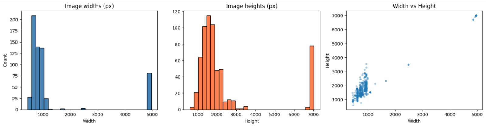
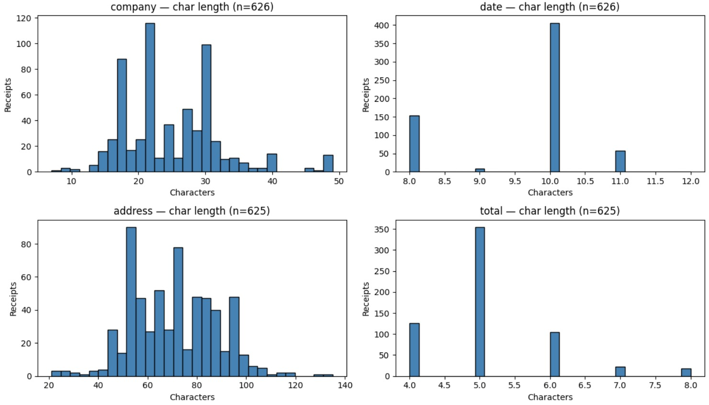
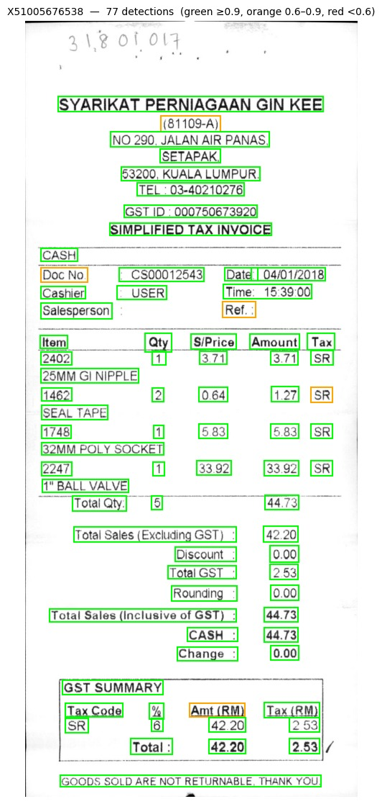
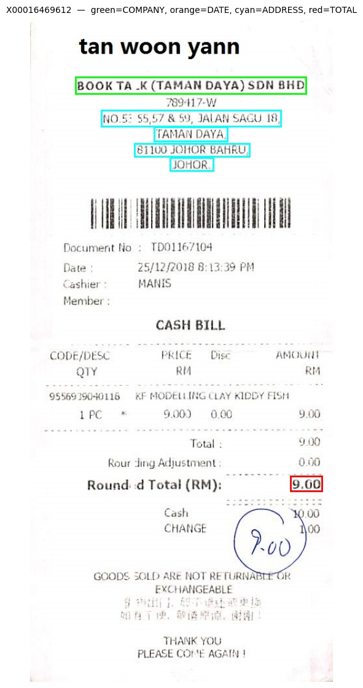
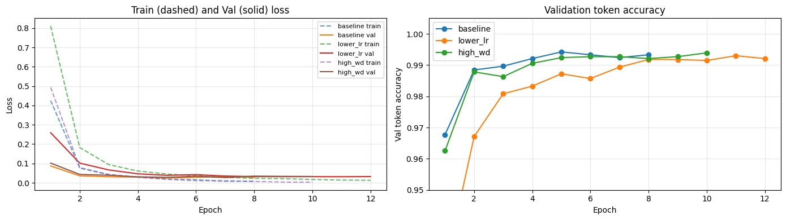
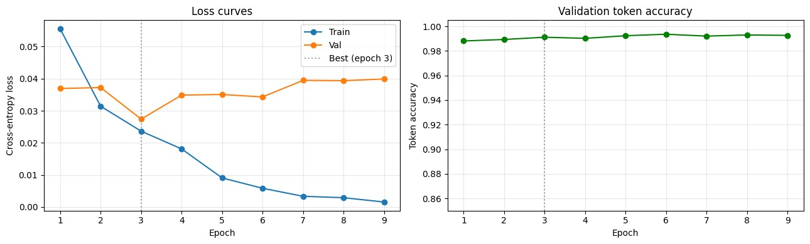
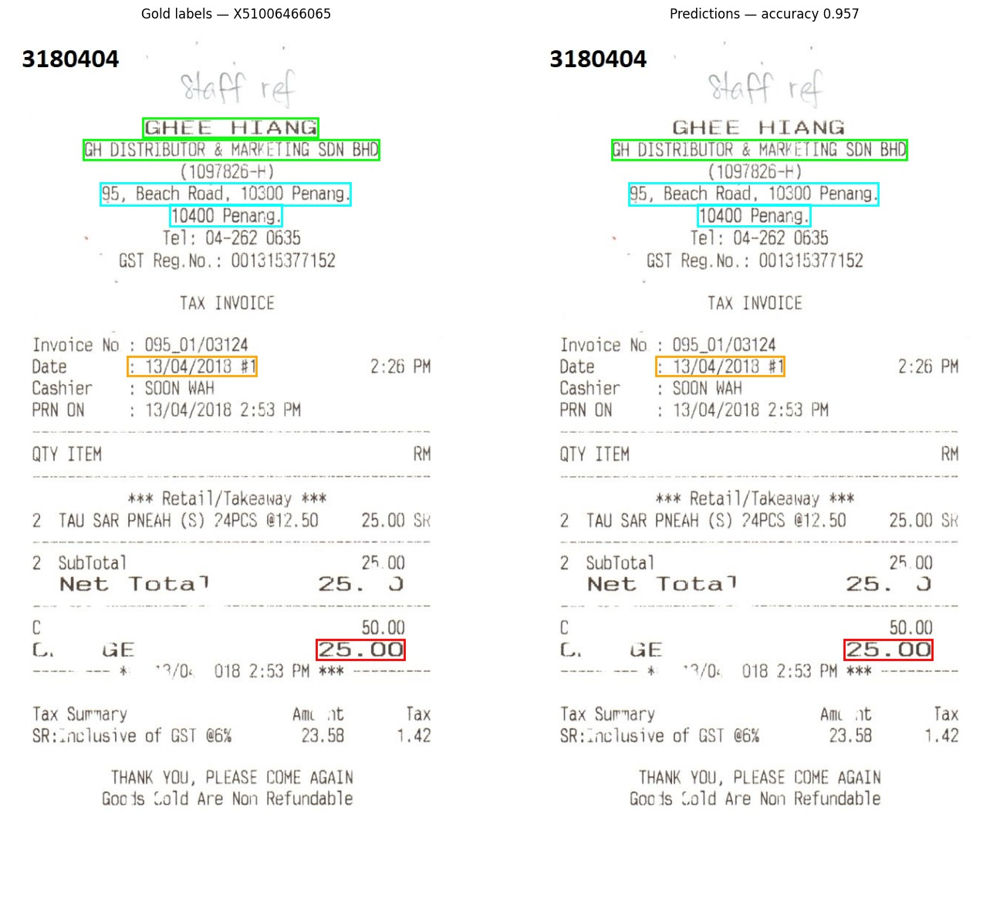

# Receipt Entity Extractor

> Key-information extraction from receipts — company, date, address, total — built on PaddleOCR + LayoutLMv3 fine-tuned on the SROIE dataset (Malaysian receipts). Achieves **0.81 fuzzy / 0.42 exact macro-F1** on 347 held-out receipts, with a regex date fallback that recovers the model's single biggest weakness without retraining.

[](https://www.python.org/)
[](https://pytorch.org/)
[](https://huggingface.co/docs/transformers)
[](LICENSE)

**🔗 Live Demo:** [Try it on Hugging Face Spaces →](https://huggingface.co/spaces/Tanishq71/Receipt-Entity-Extractor)

**🔗 Model:** [Tanishq71/sroie-layoutlmv3 →](https://huggingface.co/Tanishq71/sroie-layoutlmv3)

---

## TL;DR

| Field | F1 (exact) | F1 (fuzzy) |
|-------|-----------|-----------|
| Company | 0.17 | 0.78 |
| Date | 0.61 | 0.70 |
| Address | 0.07 | 0.91 |
| Total | 0.82 | 0.87 |
| **Macro** | **0.42** | **0.81** |

Fine-tuned `microsoft/layoutlmv3-base` for BIO token classification over four receipt fields on a 563 / 63 / 347 train / val / test split of SROIE. The headline numbers are the full production pipeline (OCR → LayoutLMv3 → post-processing), evaluated on 347 held-out receipts.

---

## Why This Project Is Different

Most public receipt-extraction projects stop at "fine-tuned LayoutLMv3, here's the F1." This one is built around **error analysis that drives design decisions**, and it reports honest numbers rather than the most flattering ones.

**1. A baseline that exposed a real weakness — and a fix that addressed it.** An OCR-only heuristic baseline (regex + positional rules, no learned layout) was built specifically to measure the value of layout-aware modeling. It revealed something useful: the baseline *beat* the fine-tuned model on the date field (0.71 vs 0.54 fuzzy-F1), because the model was under-tagging dates. That observation directly motivated a **regex date fallback** in post-processing, which recovered date exact-F1 from 0.23 to 0.60 — without retraining the model.

**2. Honest, field-level reporting with both exact and fuzzy F1.** Exact-match F1 on OCR output is brutally unforgiving: a single misread character zeroes an entire field. Address exact-F1 is just 0.07 — but that is largely because the SROIE *ground truth itself* contains OCR errors (e.g. `B1750` where the true value is `81750`). Reporting fuzzy-F1 alongside (0.91 for address) tells the real story: the model extracts addresses near-perfectly, bounded by OCR noise, not by a modeling failure.

---

## Dataset

Primary dataset: **SROIE 2019** (ICDAR Scanned Receipt OCR and Information Extraction, Task 3) — scanned Malaysian receipts annotated with four fields: company, date, address, total.

| Split | Receipts |
|-------|---------|
| Train | 563 |
| Validation | 63 |
| Test | 347 |

563 + 63 = 626 labeled training receipts (a 90 / 10 train/val split), with 347 receipts held out for test.

### Image dimensions



*Most receipts are 500–1000px wide and 1000–2000px tall, but a distinct cluster of high-resolution scans reaches roughly 5000×7000px. This long tail is what makes OCR latency vary so widely and motivated downscaling inputs to 1600px in deployment.*

### Field length distribution



*Per-field character-length distributions across the 626 labeled receipts. Date is tightly constrained (8–11 characters) and total is short (4–8), while company and address are long and highly variable — which is why long fields are reported with fuzzy-F1, and why a short, regular field like date is well-suited to a regex fallback.*

### Cross-dataset generalization datasets (zero-shot)

To probe how far the SROIE-trained model transfers, two additional datasets were evaluated zero-shot:

| Dataset | Receipts | Domain |
|---------|---------|--------|
| WildReceipt | 472 | English receipts, different label schema |
| CORD | 100 | Indonesian receipts, different schema |

FUNSD (forms) was originally planned but dropped: CORD already established that cross-language / cross-schema transfer fails completely, so a forms dataset would only repeat that finding. WildReceipt — English receipts with a different annotation schema — is a far more informative transfer target.

---

## Methodology

### Pipeline

```
image → PaddleOCR (words + boxes) → LayoutLMv3 (BIO tags) → BIO decode
      → post-processing + date fallback → {company, date, address, total}
```

A single `receipt_extractor.py` module implements this pipeline end-to-end and powers the notebook evaluation, the Gradio demo, and the deployed Space — one source of truth, no parallel implementations.

### OCR

PaddleOCR performs text detection and recognition, returning words with bounding-box polygons. Boxes are normalized into LayoutLMv3's 0–1000 coordinate space.



*PaddleOCR text detection on a sample receipt (77 detections), boxes colored by recognition confidence: green ≥ 0.9, orange 0.6–0.9, red < 0.6.*

### Label generation

Ground-truth field strings are aligned to OCR tokens via fuzzy matching to produce BIO tags — `O`, plus `B-`/`I-` for each of company / date / address / total — for 9 labels total.



*Gold entity labels projected onto a receipt — green = company, orange = date, cyan = address, red = total. These BIO-tagged spans are the supervision signal for fine-tuning.*

### Model

- **Backbone:** `microsoft/layoutlmv3-base` (~125M parameters), document-pretrained by Microsoft.
- **Head:** a 9-class token-classification head, initialized from scratch and trained on the downstream task.

### Training

- AdamW, learning rate `5e-5`, weight decay `0.01`, linear warmup schedule.
- Max 12 epochs with **early stopping (patience 3)** on validation loss.
- Batch size 4, seed 42.
- Best checkpoint at **epoch 5** (validation loss 0.0248); training halted at epoch 8.
- A manual PyTorch training loop (explicit forward / backward / optimizer / scheduler step) rather than the `Trainer` API, for full transparency over every step.



*Hyperparameter sweep over three configurations. The baseline (lr 5e-5, weight decay 0.01) reached the best validation token accuracy and was selected for the final training run; a lower learning rate converged more slowly.*



*Fine-tuning dynamics: validation loss reaches its minimum early and then rises while training loss keeps falling — the overfitting signal that best-checkpoint tracking and early stopping guard against. (Curve from a development run; the final model's best checkpoint was epoch 5.)*

### Post-processing

Field-specific cleaners (date normalization, decimal-separator fixes, whitespace) plus the **regex date fallback**: when the model tags no date, the OCR text is scanned for a date pattern — numeric (`dd/mm/yyyy` and variants) and text-month (`dd MON yyyy`) — and the first match is used, then normalized like any model-tagged date. This raised date recall from 0.39 to 0.50 and date exact-F1 from 0.23 to 0.60, with no retraining.

---

## Results

### Headline (full pipeline, SROIE test, 347 receipts)

- **Macro F1 (fuzzy): 0.81**
- **Macro F1 (exact): 0.42**

### Per-field

| Field | P (exact) | R (exact) | F1 (exact) | F1 (fuzzy) |
|-------|----------|----------|-----------|-----------|
| Company | 0.20 | 0.15 | 0.17 | 0.78 |
| Date | 0.78 | 0.50 | 0.61 | 0.70 |
| Address | 0.07 | 0.06 | 0.07 | 0.91 |
| Total | 0.86 | 0.78 | 0.82 | 0.87 |

### Qualitative example



*Gold labels (left) versus model predictions (right) on a held-out receipt — 95.7% token accuracy. Company (green), date (orange), address (cyan), and total (red) are all recovered correctly despite a faint, noisy scan.*

### Value of layout — vs an OCR-only baseline

| Metric | OCR-only baseline | LayoutLMv3 | Δ |
|--------|------------------|-----------|---|
| Macro F1 (fuzzy) | 0.43 | 0.80 | **+0.37** |
| Macro F1 (exact) | 0.28 | 0.34 | +0.06 |

Layout-aware modeling nearly doubles fuzzy macro-F1. The one exception is the date field, where the regex baseline *beat* the model (0.71 vs 0.54 fuzzy) — the observation that motivated the date fallback described above.

### Zero-shot cross-dataset transfer (fuzzy macro-F1)

| Dataset | n | Macro F1 | Notes |
|---------|---|---------|-------|
| SROIE (in-domain) | 347 | 0.80 | — |
| WildReceipt | 472 | 0.38 | date transfers well (0.75); other fields drop on schema mismatch |
| CORD | 100 | ~0.00 | full failure — Indonesian language + different schema |

> **Note on the numbers.** The baseline and cross-dataset comparisons above use the model snapshot *before* SROIE-specific date post-processing, so they isolate the model's raw transfer ability and aren't inflated by SROIE-tuned rules — SROIE scores 0.80 in those comparisons. The headline 0.81 includes post-processing. The two differ only by the date fallback.

### Inference latency

Inference is **OCR-bound**: PaddleOCR accounts for ~99% of latency (median 39.6s versus 0.13s for the model on full-resolution SROIE scans). The deployed Space downscales inputs to 1600px, cutting typical latency to roughly 5–20s on free CPU.

---

## Error Analysis

**Date — a recall problem, fixed by a fallback.** The raw model had high date *precision* (0.94) but low *recall* (0.39): when it tagged a date it was almost always right, but it abstained on ~60% of receipts. The fallback scans OCR text for date patterns when the model tags none, recovering 78% of the missed dates and roughly doubling recall.

**Address — bounded by ground-truth OCR noise.** Address exact-F1 is 0.07 but fuzzy-F1 is 0.91. The gap is mostly the SROIE labels themselves containing OCR errors (e.g. `B1750` for `81750`), which makes exact match unwinnable. The model extracts addresses near-perfectly; the metric, not the model, is the limitation.

**Company — bounded by OCR word-box merging.** Company exact-F1 is 0.17 versus fuzzy 0.78. PaddleOCR sometimes merges adjacent words (`OJC MARKETING SDN BHD` → `OJCMARKETINGSDNBHD`), erasing spaces before the model ever sees the tokens. The content is captured; only the token boundaries vary.

---

## Limitations

1. **OCR is both the bottleneck and the error ceiling.** Most remaining errors are OCR character/spacing mistakes (`Ja1an` for `Jalan`), which no amount of layout modeling fixes — only a stronger OCR engine would.
2. **English / receipt-only.** Zero-shot transfer to Indonesian receipts (CORD) fails entirely; the model is specialized to SROIE-style Malaysian/English receipts.
3. **Exact-match metrics are bounded by label noise.** Address and company exact-F1 understate true performance; fuzzy-F1 is the more meaningful number for those fields.
4. **First-date heuristic.** The date fallback takes the first date pattern found, which can occasionally pick a printed or expiry date over the transaction date, slightly lowering date precision.
5. **Not production-validated.** This is a portfolio / research demonstration, not a validated commercial extraction system.

---

## What I'd Do Next (v2)

- **Stronger or receipt-tuned OCR** to lift the error ceiling, since OCR dominates both latency and errors.
- **Schema-agnostic training** on SROIE + WildReceipt + CORD jointly to improve cross-dataset robustness.
- **Smarter date selection** in the fallback (prefer dates near a "DATE" keyword or near the total) instead of first-match.
- **Confidence-aware extraction** — surface per-field confidence so low-confidence fields route to human review.
- **Word-box de-merging** — a lightweight dictionary/segmentation step to recover spaces lost by OCR, targeting the company exact-match gap.

---

## Repository Structure

```
receipt-entity-extractor/
├── README.md                          Project overview (this file)
├── LICENSE                            MIT license
├── requirements.txt                   Python dependencies
├── .gitignore                         Excludes data and model weights
├── app.py                             Gradio demo (deployed to HF Spaces)
├── receipt_extractor.py               End-to-end inference pipeline
├── postprocessing.py                  Field cleaners + regex date fallback
├── notebook/
│   └── receipt_entity_extractor.ipynb End-to-end build: data → OCR →
│                                       fine-tuning → evaluation → pipeline
└── assets/                            Figures used in this README
    ├── image_dimensions.png
    ├── field_length_distribution.png
    ├── ocr_detection_example.png
    ├── entity_labels_example.png
    ├── hyperparameter_sweep.png
    ├── training_curves.png
    └── prediction_example.png
```

---

## How to Reproduce

### 1. Clone the repository

```bash
git clone https://github.com/Tanishqarya17/receipt-entity-extractor.git
cd receipt-entity-extractor
```

### 2. Install dependencies

```bash
pip install -r requirements.txt
```

The project was developed on Google Colab (PyTorch 2.x, Python 3.12, Tesla T4 GPU). A GPU speeds up training but is not required for inference. `requirements.txt` is intentionally unpinned for cross-environment compatibility, except for the Gradio and PaddlePaddle versions used by the deployed Space.

### 3. Get the data

The datasets are not included. Download SROIE 2019 (and, for the cross-dataset study, WildReceipt and CORD) from the links in Acknowledgments and place the raw files following the structure expected at the top of the notebook.

### 4. Run the notebook

Open `notebook/receipt_entity_extractor.ipynb` and run the sections in order. It covers data acquisition, OCR, label generation, fine-tuning, evaluation, the cross-dataset and baseline studies, post-processing, and the end-to-end pipeline.

### 5. Use the trained model directly

To skip training: the fine-tuned weights live in the [Hugging Face model repo](https://huggingface.co/Tanishq71/sroie-layoutlmv3). Set `MODEL_ID=Tanishq71/sroie-layoutlmv3` and run `python app.py` to launch the same Gradio interface that is deployed live.

---

## Acknowledgments

- **SROIE 2019 (ICDAR)** — scanned receipt OCR and information-extraction dataset.
- **CORD** and **WildReceipt** — datasets used for the zero-shot cross-dataset study.
- **Microsoft / LayoutLMv3** — pretrained layout-aware document model.
- **PaddleOCR (PaddlePaddle)** — text detection and recognition engine.
- **Hugging Face Transformers** and **Gradio** — modeling and demo tooling.

---

## Contact

**Tanishq Arya**

- GitHub: [@Tanishqarya17](https://github.com/Tanishqarya17)
- Email: [tanishqarya789@gmail.com](mailto:tanishqarya789@gmail.com)
- LinkedIn: [@TanishqArya](https://www.linkedin.com/in/tanishq-arya-b10598292/)

---

## License

MIT License. See [LICENSE](LICENSE) for details.
